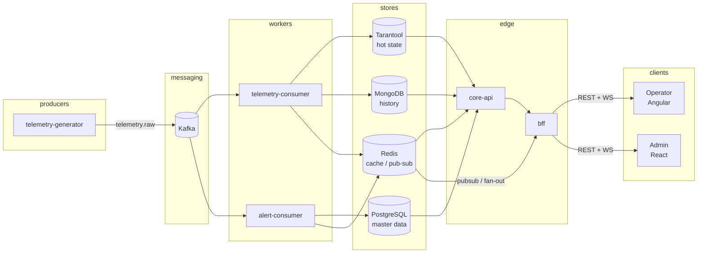

# Architecture

## Цель

Пет-проект промышленного мониторинга: эмуляция датчиков → поток событий → хранилища → BFF → два фронта (Operator / Admin) в realtime.

Фокус обучения: Kafka, Redis, Tarantool, MongoDB, PostgreSQL, BFF, WebSocket, auth.

## Высокоуровневая схема

## Сервисы (логически)

| Сервис | Роль |
|--------|------|
| `telemetry-generator` | Читает активные датчики из Postgres, эмулирует сигнал, пишет в Kafka |
| `telemetry-consumer` | Читает сырой поток, пишет hot state + историю |
| `alert-consumer` | Сравнивает с порогами, создаёт алерты |
| `core-api` | Доменная логика, доступ к хранилищам |
| `bff` | Сборка ответов под UI, auth-сессия, WebSocket |

На старте MVP все Node-процессы могут жить в одном репо (`apps/*`) и подниматься через Docker Compose. Разделение процессов важнее, чем отдельные репозитории.

## Поток данных (happy path)

1. Generator читает активные `sensors` из Postgres (refresh раз в `GENERATOR_SENSOR_REFRESH_MS`) и публикует точки в топик `telemetry.raw`. Профиль сигнала: seed-датчики — как в `SEED_SENSORS`; остальные — дефолты по `metric`.
2. `telemetry-consumer`:
   - обновляет текущее значение в Tarantool;
   - пишет точку в MongoDB;
   - публикует событие в Redis pub/sub (для fan-out в BFF).
3. `alert-consumer` при устойчивом нарушении порога (debounce) пишет алерт в Postgres и шлёт событие в Redis. Краткий возврат в норму не закрывает алерт (гистерезис).
4. BFF подписан на Redis и пушит обновления в WebSocket-клиентов.
5. REST через BFF отдаёт агрегаты для первого экрана и админских CRUD.

## Зачем каждое хранилище

| Технология | Ответственность |
|------------|-----------------|
| **Kafka** | Буфер и развязка producer/consumer, повторная обработка |
| **Tarantool** | Горячее состояние: «последнее значение по sensorId» |
| **Redis** | Кэш overview, pub/sub для realtime, опционально rate-limit / сессии |
| **MongoDB** | История точек телеметрии (append-only). Длинные графики — downsample в запросе, не отдельная БД |
| **PostgreSQL** | Пользователи, роли, объекты/линии, датчики, пороги, алерты |

SQL нужен: справочники и связи реляционные. Mongo — под поток измерений. Это не дублирование «на всякий случай», а разные паттерны доступа.

## Auth

- Логин идёт через **BFF** (`/api`) с server-side session в Redis и httpOnly cookie `it_session`.
- Cookie имеет TTL 8 часов; frontend не получает session token в JSON.
- Роли: `operator`, `admin`.
- BFF проверяет сессию и роль перед REST/WebSocket доступом; frontend не ходит в `core-api` напрямую.
- Operator UI — чтение realtime + алерты; Admin UI — CRUD справочников, пороги, пользователи.

Подробнее по эндпоинтам: [api-sketch.md](./api-sketch.md).

## Фронты

Два независимых SPA (не Module Federation на MVP):

- **Operator** (Angular) — мониторинг «здесь и сейчас».
- **Admin** (React + Vite) — конфигурация и аналитика.

Оба говорят только с BFF. Прямых запросов к Kafka/Redis/Mongo из браузера нет.

## Репозиторий (монорепа)

| Путь | Содержимое |
|------|------------|
| `apps/backend` | Nest apps, workers, compose, эта документация |
| `apps/operator` | Angular Operator |
| `apps/admin` | React Admin |

## Вне scope MVP (фаза 2+)

- Module Federation / единый shell
- Отдельный OpenAPI-пакет `contracts`
- SSO / OAuth
- Kubernetes
- Идемпотентность consumers «как в проде» сверх базового

См. [mvp.md](./mvp.md).
