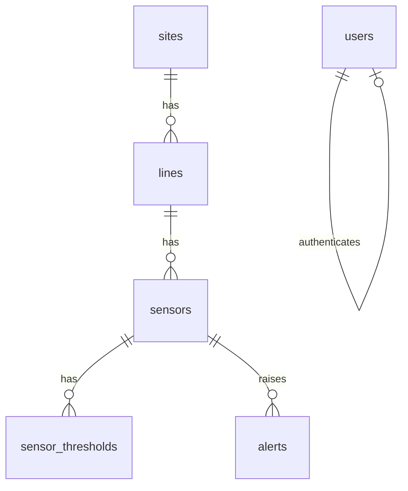

# Data model

Черновик модели. Имена могут уточняться при реализации.

## PostgreSQL — master data

Реализовано через Prisma: `prisma/schema.prisma`, миграции в `prisma/migrations/`, seed — `npm run prisma:seed`.

Стабильные UUID seed — `SEED_IDS` в `libs/common` (демо site/line/sensors). Generator публикует телеметрию по **всем активным** `sensors` из Postgres, не только по `SEED_SENSORS`.

### `users`

| Поле | Тип | Описание |
|------|-----|----------|
| id | uuid PK | |
| email | text unique | логин |
| password_hash | text | |
| role | enum(`operator`, `admin`) | |
| created_at | timestamptz | |

### `sites` (промышленные объекты)

| Поле | Тип |
|------|-----|
| id | uuid PK |
| code | text unique |
| name | text |
| created_at | timestamptz |

### `lines` (линии / участки)

| Поле | Тип |
|------|-----|
| id | uuid PK |
| site_id | uuid FK → sites |
| code | text |
| name | text |

### `sensors`

| Поле | Тип | Описание |
|------|-----|----------|
| id | uuid PK | |
| line_id | uuid FK → lines | |
| code | text | например `T-101` |
| name | text | |
| metric | enum(`temperature`, `pressure`, `vibration`, `flow`) | |
| unit | text | `°C`, `bar`, … |
| is_active | boolean | |
| created_at | timestamptz | |

### `sensor_thresholds`

| Поле | Тип | Описание |
|------|-----|----------|
| id | uuid PK | |
| sensor_id | uuid FK → sensors | |
| min_value | numeric null | |
| max_value | numeric null | |
| severity | enum(`warning`, `critical`) | |

### `alerts`

| Поле | Тип | Описание |
|------|-----|----------|
| id | uuid PK | |
| sensor_id | uuid FK | |
| severity | enum | |
| status | enum(`open`, `acked`, `resolved`) | |
| message | text | |
| value | numeric | значение в момент срабатывания |
| opened_at | timestamptz | |
| resolved_at | timestamptz null | |

## MongoDB — история телеметрии

Коллекция `telemetry_points` (документы):

```json
{
  "_id": "ObjectId",
  "sensorId": "uuid",
  "siteId": "uuid",
  "lineId": "uuid",
  "metric": "temperature",
  "value": 72.4,
  "unit": "°C",
  "ts": "2026-08-21T10:00:00.000Z"
}
```

Индексы:

- `{ sensorId: 1, ts: -1 }` — создаёт `telemetry-consumer` при старте и `core-api` (history)
- `{ siteId: 1, ts: -1 }`
- TTL опционально позже (если нужна автоочистка)

Длинные окна (6ч/24ч) **не** требуют отдельной коллекции: `GET /sensors/:id/history` делает query-time `$group` по бакету в той же `telemetry_points`. Raw (≤2ч) остаётся `find + limit`.

## Tarantool — hot state

Space `sensor_latest` (ключ = `sensorId`):

| Поле | Описание |
|------|----------|
| sensor_id | string / uuid |
| value | number |
| unit | string |
| metric | string |
| ts | number (unix ms) |
| site_id | string |
| line_id | string |

Чтение «текущие значения по объекту» — без скана Mongo.

## Redis

| Ключ / канал | Назначение |
|--------------|------------|
| `cache:overview:{siteId}` | короткий TTL-кэш агрегата для дашборда |
| `telemetry:updates` | pub/sub: новая точка |
| `alerts:updates` | pub/sub: новый/изменённый алерт |
| `session:*` | опционально, если сессии в Redis |

## Kafka

| Топик | Содержимое |
|-------|------------|
| `telemetry.raw` | сырые точки от generator |
| `alerts.commands` | опционально на фазе 2 (ack/resolve через события) |

Пример сообщения `telemetry.raw`:

```json
{
  "sensorId": "…",
  "siteId": "…",
  "lineId": "…",
  "metric": "pressure",
  "value": 3.2,
  "unit": "bar",
  "ts": "2026-08-21T10:00:00.000Z"
}
```

## Связь сущностей



История точек в Mongo **не** FK в Postgres: связь по `sensorId` (uuid), целостность обеспечивает приложение / seed.
